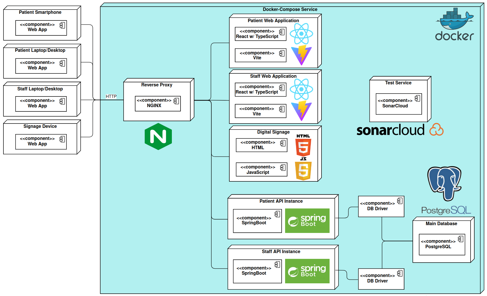

# PhiHub

## Abstract

This repository presents the PhiHub project, a multi-layer application designed to improve patient management and administrative efficiency in hospital settings. The project, aims to provide a seamless integration of appointment scheduling, queue management, and payments, thereby addressing the challenges faced by patients, medical staff, and administrative personnel in hospitals.

## Equipa

| Role          | Nome             | **Email**              | NMEC   
| ------------- | ---------------- | ---------------------- | ------ 
| Team Manager  | Rodrigo Aguiar   | rodrigoaguiar96@ua.pt  | 108969
| Product Owner | João Luís        | jnluis@ua.pt           | 107403
| QA Engineer   | Daniel Madureira | daniel.madureira@ua.pt | 107603
| DevOps Master | Pedro Ramos      | p.ramos@ua.pt          | 107348

## Architecture

    

## Project Bookmarks: 

- API Documentation: localhost:8080/docs

- Project Backlog - [Jira](https://ua-team-n2bc7vdc.atlassian.net/jira/software/projects/PHIH/boards/2?atlOrigin=eyJpIjoiZjAwNmM1NTcwZTZlNGJhMjlhYzgxNTg3NGZlOGFjMWMiLCJwIjoiaiJ9) 

- Static Analysis - [Sonar Cloud](https://sonarcloud.io/summary/overall?id=PhiHub-UA_Patient-Backend)

- Product Specification Report: [PhiHub - Google Docs](https://docs.google.com/document/d/1YBmS7e0aVOPJ0aEdWH9sRwEJVAxUyuLt/edit)

- CI/CD Environment - Github Actions
